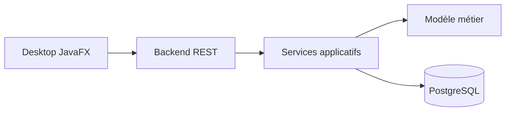

# Alexis Guinot

### Développeur informatique junior

#### Java • Backend • Desktop • PostgreSQL • Linux

Je recherche une **alternance en développement informatique** orientée développement logiciel, backend Java, applications métier ou outils internes.

  
  

  
  
  
  
  

---

## Profil

Développeur informatique junior, titulaire d’un **BTS développeur informatique en alternance**, avec une expérience en développement logiciel, électronique, projets personnels complexes et entrepreneuriat.

Je construis principalement des applications structurées autour de Java, du backend, des bases de données relationnelles, des interfaces desktop et de l’outillage développeur.

> [!IMPORTANT]
> Recherche actuelle : **alternance en développement informatique** pour continuer à progresser sur des projets concrets, maintenables et utiles.

---

## Ce que je peux apporter

<table>
  <tr>
    <th>Compétence</th>
    <th>Application concrète</th>
  </tr>
  <tr>
    <td><strong>Développement Java</strong></td>
    <td>Applications desktop, backend, architecture modulaire, projets complets</td>
  </tr>
  <tr>
    <td><strong>Backend</strong></td>
    <td>API REST, logique métier, persistance, validation, structuration de services</td>
  </tr>
  <tr>
    <td><strong>Base de données</strong></td>
    <td>SQL, PostgreSQL, migrations, modélisation de données</td>
  </tr>
  <tr>
    <td><strong>Interface utilisateur</strong></td>
    <td>JavaFX, écrans métier, ergonomie, affichage de données</td>
  </tr>
  <tr>
    <td><strong>Culture système</strong></td>
    <td>Linux, scripts, Git, Maven, Docker Compose, environnement de développement</td>
  </tr>
  <tr>
    <td><strong>Projets techniques</strong></td>
    <td>Moteur 2D/3D, modding, IA locale, outils de productivité, électronique</td>
  </tr>
</table>

---

## Stack principale

  
  
  
  
  
  
  

### Technologies déjà pratiquées

| Domaine                | Technologies                                            |
| ---------------------- | ------------------------------------------------------- |
| Langages               | Java, SQL, C++, PHP, Python, Bash, PowerShell           |
| Backend                | Spring Boot, REST API, FastAPI, Flask                   |
| Données                | PostgreSQL, SQL, Redis                                  |
| Desktop / UI           | JavaFX, Swing, WPF                                      |
| Web                    | HTML, CSS, JavaScript, TypeScript, React, Astro, Svelte |
| DevOps / outils        | Git, Maven, Gradle, Docker, CI/CD, SSH                  |
| Graphique / bas niveau | LWJGL, OpenGL, Vulkan, GLSL                             |
| IA locale              | Llama.cpp, Ollama, LM Studio, Hugging Face              |

---

## Projet principal

### Solvia

Application **local-first** de suivi patrimonial personnel.

Solvia permet de suivre des comptes, actifs, positions, snapshots, flux financiers, historiques de valorisation et indicateurs de performance.

  

#### Ce que ce projet démontre

* conception d’une application Java complète ;
* séparation backend / desktop / domaine / persistance ;
* création d’une API REST ;
* persistance SQL ;
* architecture Maven multi-module ;
* interface desktop JavaFX ;
* documentation technique ;
* logique métier orientée fiabilité des calculs.

#### Architecture simplifiée

Repository : [alescis-wuin/Solvia](https://github.com/alescis-wuin/Solvia)

---

## Autres projets

### Moteur 2D/3D Java avec LWJGL

Projet personnel autour d’un moteur et d’éditeurs de jeu vidéo 2D/3D en Java.

Compétences mobilisées :

* Java ;
* LWJGL ;
* OpenGL ;
* gestion de fenêtre ;
* rendu graphique ;
* structuration moteur / client / éditeur ;
* logique de ressources graphiques.

---

### Projets de modding et outils de jeu

Participation à des projets de modding et d’outillage autour du jeu vidéo, notamment avec du C++, Python, systèmes de scripts, lanceurs et frameworks.

Ce type de projet m’a permis de travailler sur :

* la compréhension de code existant ;
* la compatibilité avec des systèmes complexes ;
* la collaboration technique ;
* la maintenance d’outils utilisés par une communauté.

---

### Plateforme de productivité boostée à l’IA

Projet personnel autour de la productivité et de l’IA locale.

Axes techniques :

* agents et assistants locaux ;
* intégration d’outils IA ;
* automatisation ;
* interfaces utilisateur ;
* structuration de workflows.

---

## Expérience et parcours

| Période     | Expérience                                                                                              |
| ----------- | ------------------------------------------------------------------------------------------------------- |
| 2023 – 2025 | Alternance développeur informatique et électronicien chez Familink                                      |
| 2023        | BTS en alternance — développeur informatique                                                            |
| 2025        | Statut national d’étudiant entrepreneur                                                                 |
| 2025        | Certification entrepreneur CCI                                                                          |
| 2021        | Bac scientifique : mathématiques, sciences de l’ingénieur, physique-chimie, NSI, mathématiques expertes |

---

## Engagements et projets portés

Je m’intéresse aux projets techniques ayant un impact concret.

* Bénévolat et adhésion chez Handisup ;
* participation à des projets liés à l’inclusion des personnes en situation de handicap ;
* projet Cap’Able autour de l’inclusion et de l’accessibilité ;
* réflexion autour de solutions de confiance pour les collaborations professionnelles, notamment via les smart contracts.

---

<strong>Axes de progression technique</strong>

Je cherche actuellement à renforcer :

* les tests automatisés ;
* la conception backend ;
* les architectures applicatives propres ;
* la documentation technique ;
* la qualité d’interface ;
* l’intégration continue ;
* les pratiques d’équipe en contexte professionnel.

---

<strong>Centres d’intérêt techniques</strong>

* développement logiciel ;
* électronique ;
* IA locale ;
* outils développeur ;
* systèmes Linux ;
* moteurs graphiques ;
* botanique et sciences appliquées.

---

## Contact

* LinkedIn : [Alexis Guinot](https://www.linkedin.com/in/alexis-guinot/)
* GitHub : [alescis-wuin](https://github.com/alescis-wuin)

<!--
TODO:
- Ajouter une capture propre de Solvia dans assets/solvia-preview.png
- Ajouter un lien vers un CV français public si souhaité
- Épingler Solvia en premier sur le profil GitHub
- Ajouter description + topics aux dépôts principaux
-->
