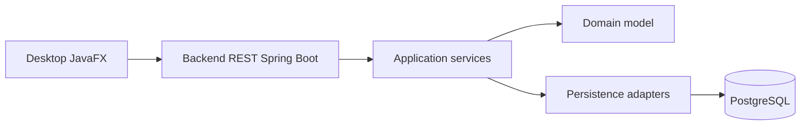

# Alexis Guinot

### Développeur logiciel junior

#### Java • Spring Boot • JavaFX • PostgreSQL • Linux

Je recherche une **alternance en développement informatique** orientée développement logiciel, backend Java ou applications métier.

  
  

  
  
  
  
  

---

## Profil

Développeur informatique junior, titulaire d’un niveau **Bac+2**, je construis principalement des applications Java structurées avec backend REST, interface desktop, base de données relationnelle et architecture modulaire.

Mon objectif est de rejoindre une entreprise en alternance afin de progresser sur des projets réels, maintenables et utiles, avec une montée en compétence solide sur le développement logiciel.

> [!IMPORTANT]
> Recherche actuelle : **alternance en développement informatique**, idéalement sur des sujets Java, backend, fullstack, applications métier ou outils internes.

---

## Stack technique

<table>
  <tr>
    <th>Domaine</th>
    <th>Technologies</th>
  </tr>
  <tr>
    <td><strong>Langages</strong></td>
    <td>Java, SQL, C++, PHP, GLSL</td>
  </tr>
  <tr>
    <td><strong>Backend</strong></td>
    <td>Spring Boot, API REST, validation, architecture modulaire</td>
  </tr>
  <tr>
    <td><strong>Données</strong></td>
    <td>PostgreSQL, Flyway, Spring JDBC</td>
  </tr>
  <tr>
    <td><strong>Desktop</strong></td>
    <td>JavaFX, AtlantaFX</td>
  </tr>
  <tr>
    <td><strong>Graphique / bas niveau</strong></td>
    <td>LWJGL, GLFW, OpenGL, OpenAL, Vulkan</td>
  </tr>
  <tr>
    <td><strong>Outils</strong></td>
    <td>Git, GitHub, Maven, Docker Compose, Linux, IntelliJ IDEA</td>
  </tr>
</table>

---

## Projet principal

### Solvia

Application **local-first** de suivi patrimonial personnel.

Solvia permet de suivre des comptes, actifs, positions, snapshots, flux financiers, historiques de valorisation et indicateurs de performance.

  

#### Stack

  
  
  
  
  
  

#### Ce que ce projet démontre

* conception d’une application Java complète ;
* séparation backend / desktop / domaine / persistance ;
* création d’une API REST ;
* utilisation de PostgreSQL et migrations Flyway ;
* architecture Maven multi-module ;
* scripts de lancement ;
* documentation technique ;
* logique métier orientée fiabilité des calculs.

#### Architecture simplifiée

Repository : [alescis-wuin/Solvia](https://github.com/alescis-wuin/Solvia)

---

## Autre projet notable

### Onsiea Engine

Moteur 2D/3D expérimental développé en Java avec LWJGL.

Stack utilisée :

* Java ;
* LWJGL ;
* GLFW ;
* OpenGL ;
* OpenAL ;
* GLSL ;
* expérimentation Vulkan.

Ce projet m’a permis de travailler sur la structuration d’un moteur graphique, la gestion de fenêtre, le rendu, les ressources graphiques et audio, ainsi que la séparation entre moteur, client et logique applicative.

Repository : [alescis-wuin/Onsiea](https://github.com/alescis-wuin/Onsiea)

---

## Ce que je cherche à démontrer

| Compétence              | Exemple concret                                               |
| ----------------------- | ------------------------------------------------------------- |
| Développement Java      | Solvia, backend Spring Boot, desktop JavaFX                   |
| Architecture logicielle | Séparation domaine / application / infrastructure / interface |
| Base de données         | PostgreSQL, migrations Flyway, accès SQL                      |
| Interface utilisateur   | JavaFX, AtlantaFX, écrans métier                              |
| Autonomie technique     | Projets complets, documentation, scripts                      |
| Curiosité technique     | LWJGL, OpenGL, Vulkan, Linux                                  |

---

<strong>Statistiques GitHub</strong>

  

  

---

<strong>Axes de progression</strong>

Je cherche actuellement à renforcer :

* les tests automatisés ;
* la qualité d’interface ;
* la conception backend ;
* la documentation projet ;
* la CI GitHub Actions ;
* les pratiques de code maintenable en contexte professionnel.

---

## Contact

* LinkedIn : [Alexis Guinot](https://www.linkedin.com/in/alexis-guinot/)
* GitHub : [alescis-wuin](https://github.com/alescis-wuin)

<!--
TODO:
- Ajouter une capture de Solvia dans assets/solvia-preview.png
- Ajouter un CV français si souhaité
- Épingler Solvia en premier sur le profil GitHub
- Ajouter topics + description à Solvia
-->
